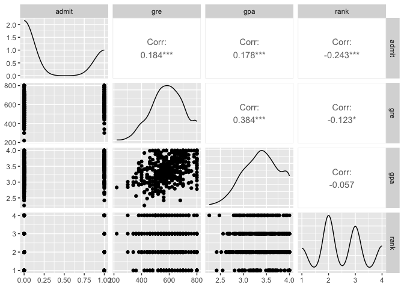
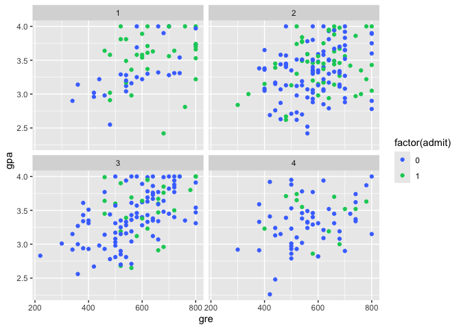
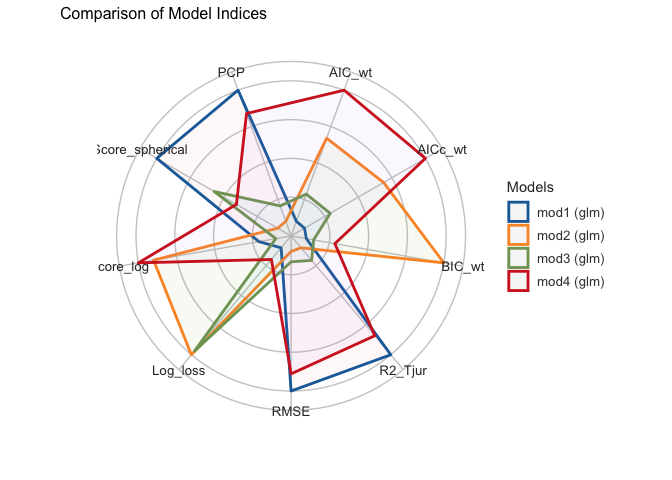
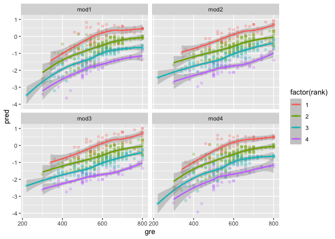
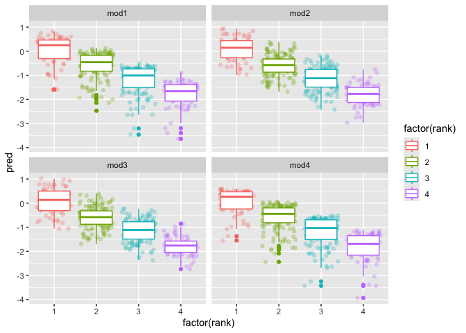
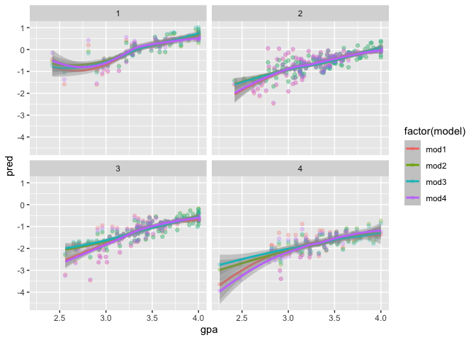
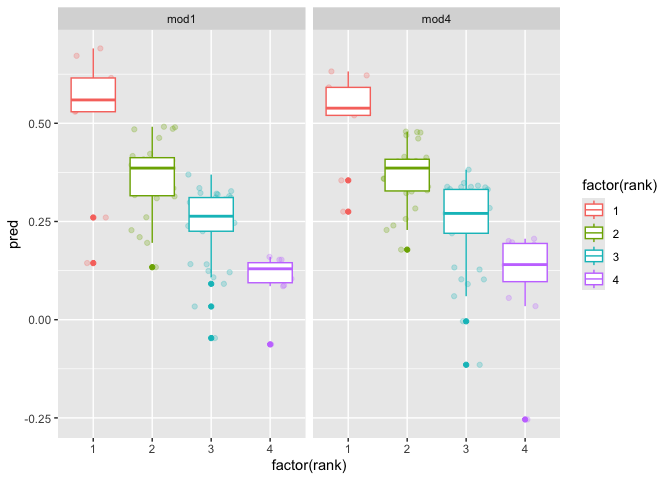

### Load in packages  

```r
library(tidyverse)
library(easystats)
library(modelr)
library(GGally)
library(caret)
```

### Loading in Data  

```r
df <- read_csv("../../Data/GradSchool_Admissions.csv")
```

```
## Rows: 400 Columns: 4
## ── Column specification ────────────────────────────────────────────────────────
## Delimiter: ","
## dbl (4): admit, gre, gpa, rank
## 
## ℹ Use `spec()` to retrieve the full column specification for this data.
## ℹ Specify the column types or set `show_col_types = FALSE` to quiet this message.
```
### Look at the structure of Grad School Admissions data

```r
glimpse(df)
```

```
## Rows: 400
## Columns: 4
## $ admit <dbl> 0, 1, 1, 1, 0, 1, 1, 0, 1, 0, 0, 0, 1, 0, 1, 0, 0, 0, 0, 1, 0, 1…
## $ gre   <dbl> 380, 660, 800, 640, 520, 760, 560, 400, 540, 700, 800, 440, 760,…
## $ gpa   <dbl> 3.61, 3.67, 4.00, 3.19, 2.93, 3.00, 2.98, 3.08, 3.39, 3.92, 4.00…
## $ rank  <dbl> 3, 3, 1, 4, 4, 2, 1, 2, 3, 2, 4, 1, 1, 2, 1, 3, 4, 3, 2, 1, 3, 2…
```


### Plots to explore the data  


```r
df %>% ggpairs()
```

<!-- -->

```r
df %>% 
    ggplot(aes(x = gre, y = gpa, color = factor(admit))) +
    geom_point() +
    scale_color_manual(values = c('royalblue1', 'springgreen3')) +
    facet_wrap(~rank)
```

<!-- -->
I'm going to model on admit, the graphs above don't appear to show gre, gpa, or rank as being more significant than the others.  

### Creating models

```r
mod1 <- glm(data = df, 
            as.logical(admit) ~ gre * gpa * rank,
            family = "binomial")

mod2 <- glm(data = df, 
            as.logical(admit) ~ gre + gpa + rank,
            family = "binomial")

mod3 <- glm(data = df, 
            as.logical(admit) ~ gre + gpa * rank,
            family = "binomial")

mod4 <- glm(data = df, 
            as.logical(admit) ~ gre * gpa + rank,
            family = "binomial")
```
All of the models are pretty similar in their RMSE and R2 scores. Model 1 and 4 both have their benefits, but model 1 is less complex so we dont need to worry about overfitting.

### Comparing model preformance  

```r
compare_performance(mod1, mod2, mod3, mod4)
```

```
## # Comparison of Model Performance Indices
## 
## Name | Model | AIC (weights) | AICc (weights) | BIC (weights) | Tjur's R2 |  RMSE | Sigma | Log_loss | Score_log | Score_spherical |   PCP
## ------------------------------------------------------------------------------------------------------------------------------------------
## mod1 |   glm | 472.2 (0.030) |  472.6 (0.027) | 504.2 (<.001) |     0.106 | 0.440 | 1.000 |    0.570 |   -50.593 |           0.005 | 0.613
## mod2 |   glm | 467.4 (0.333) |  467.5 (0.340) | 483.4 (0.794) |     0.099 | 0.442 | 1.000 |    0.574 |   -50.496 |           0.004 | 0.609
## mod3 |   glm | 469.3 (0.129) |  469.5 (0.128) | 489.3 (0.042) |     0.100 | 0.442 | 1.000 |    0.574 |   -50.609 |           0.004 | 0.610
## mod4 |   glm | 466.6 (0.508) |  466.7 (0.505) | 486.6 (0.165) |     0.105 | 0.440 | 1.000 |    0.571 |   -50.481 |           0.004 | 0.612
```

```r
compare_performance(mod1, mod2, mod3, mod4) %>% 
    plot()
```

<!-- -->

### Looking at predictions


```r
df %>%
    gather_predictions(mod1, mod2, mod3, mod4) %>% 
    ggplot(aes(x = gre, y = pred, color = factor(rank))) +
    geom_point(alpha = .25) +
    geom_smooth() +
    facet_wrap(~model)
```

```
## `geom_smooth()` using method = 'loess' and formula = 'y ~ x'
```

<!-- -->

```r
df %>%
    gather_predictions(mod1, mod2, mod3, mod4) %>% 
    ggplot(aes(x = factor(rank), y = pred, color = factor(rank))) +
    geom_jitter(alpha = .25) +
    geom_boxplot() +
    facet_wrap(~model)
```

<!-- -->

```r
df %>% 
    gather_predictions(mod1, mod2, mod3, mod4) %>% 
    ggplot(aes(x = gpa, y = pred, color = factor(model))) +
    geom_point(alpha = .25) +
    geom_smooth() +
    facet_wrap(~rank)
```

```
## `geom_smooth()` using method = 'loess' and formula = 'y ~ x'
```

<!-- -->

Looking at these three plots you can see that the 4 models are performing similarly to each other. I want to do a cross validation to see how model 1 and model 4 perform. To do so I will split the data "randomly" into training and testing sets. 


```r
id <- createDataPartition(df$admit, p = 0.8, list = FALSE)

train <- df[id,]
test <- df[-id,]
```

### Retraining the models

```r
mod1_formula <- mod1$formula
mod1 <- glm(data = train, formula = mod1_formula)

mod4_formula <- mod4$formula
mod4 <- glm(data = train, formula = mod4_formula)
```

### Then evaluate the retrained models

```r
gather_predictions(test, mod1, mod4) %>% 
    ggplot(aes(x = factor(rank), y = pred, color = factor(rank))) + 
    geom_jitter(alpha = 0.25) +
    geom_boxplot() +
    facet_wrap(~model)
```

<!-- -->

```r
compare_performance(mod1, mod4)
```

```
## # Comparison of Model Performance Indices
## 
## Name | Model | AIC (weights) | AICc (weights) | BIC (weights) |    R2 |  RMSE | Sigma
## -------------------------------------------------------------------------------------
## mod1 |   glm | 400.0 (0.100) |  400.6 (0.087) | 433.9 (<.001) | 0.119 | 0.440 | 0.445
## mod4 |   glm | 395.6 (0.900) |  395.9 (0.913) | 418.2 (>.999) | 0.115 | 0.441 | 0.444
```
### In conclusion  
- Model 4 is the best for predicting graduate school admissions based on the cross-validation.   
- All models demonstrate similar RMSE and R2 scores.   
- There is no best predictor between GRE, GPA, and school rank.  

